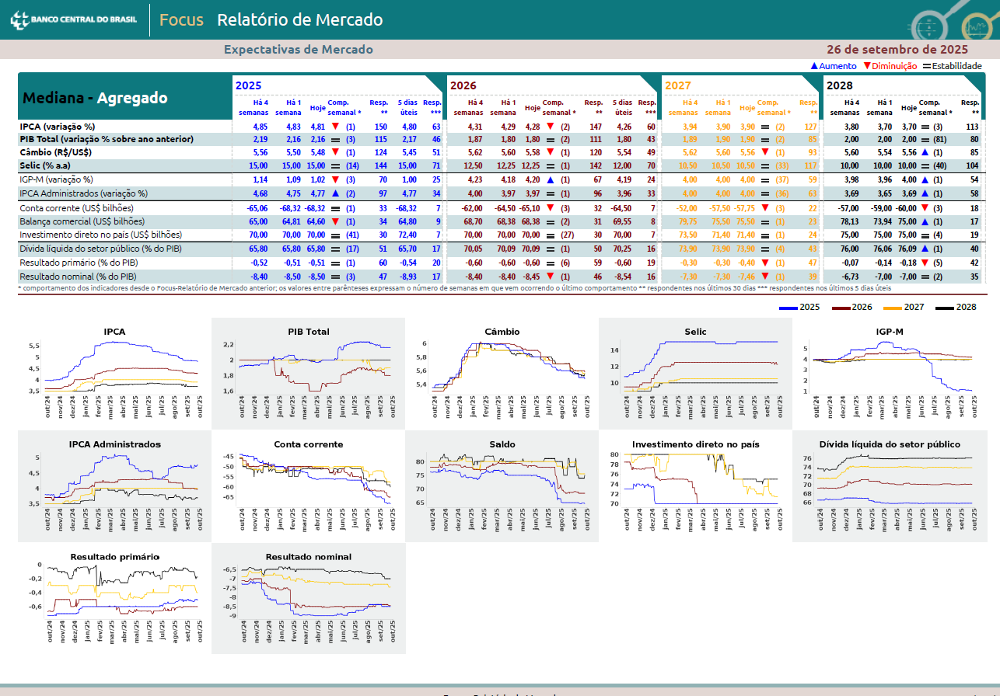
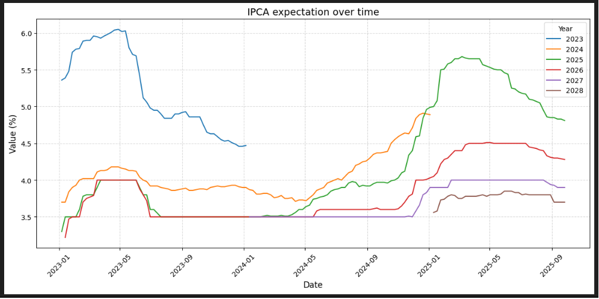

# PDF Data Extraction Pipeline

End-to-end pipeline for downloading and extracting structured data from economic report PDFs with varying formats.

## Overview

This project automates the collection and processing of Focus Reports from Brazil's Central Bank. It handles the complete workflow from API download to structured CSV output, dealing with different PDF formats and layouts.


*Example of source PDF with tabular economic data*

## Pipeline Steps

1. **Download**: `src/extract/download_pdfs_hist.py` - Fetches historical PDFs from Central Bank API with configurable date range
2. **Extract**: `src/transform/extract_infos_from_pdf.py` - Processes PDFs using intelligent multi-method extraction with automatic fallback to OCR when needed
3. **Analyze**: `src/examples/analysis_example.ipynb` - Visualization and data validation


*Market expectations evolution over time*

## Key Features

**API Integration**  
Downloads PDFs directly from the official source with date filtering to collect only the desired time period.

**Intelligent Extraction**  
Automatically tries multiple extraction methods (pdfplumber → pdfminer → OCR) to handle various PDF formats and quality levels.

**Data Normalization**  
Handles inconsistent indicator naming across different report versions and cleans numeric data for analysis.

## Tech Stack

- **Data Collection**: Python requests (API integration)
- **PDF Processing**: pdfplumber, pdfminer, Tesseract OCR
- **Data Wrangling**: Pandas, regex
- **Analysis**: Jupyter notebooks

## Quick Start

```bash
# Install dependencies
poetry install

# Download PDFs from API (configure date range in script)
python src/extract/download_pdfs_hist.py

# Extract data to CSV
python src/transform/extract_infos_from_pdf.py

# View analysis examples
jupyter notebook src/examples/analysis_example.ipynb
```

## Output

```csv
ref_date,indicator,year,value
2023-09-17,IPCA,2023,5.35
2023-09-17,IPCA,2024,4.1
2023-09-17,PIB,2023,3.04
```

Each row represents market expectations published on a specific date for an economic indicator and target year.

## Project Structure

```
├── src/
│   └── examples/
│       ├── analysis_example.ipynb
│       ├── pdf_example.png
│       └── chart_example.png
│   └── extract/
│       └── download_pdfs_hist.py    # API download script
│   └── trasnform/
│       └── extract_infos_from_pdf.py    # Main extraction data script
├── data/
│   ├── example_raw/             # Sample PDFs
│   ├── raw/                     # Downloaded PDFs
│   └── processed/               # Output CSV
```

## Results

- 200+ PDFs processed from API
- 2,400+ structured records extracted
- Robust handling of format variations

## Use Cases

This pipeline architecture can be adapted for:
- Financial report processing
- Invoice automation
- Legal document extraction
- Any PDF collection requiring structured data output

